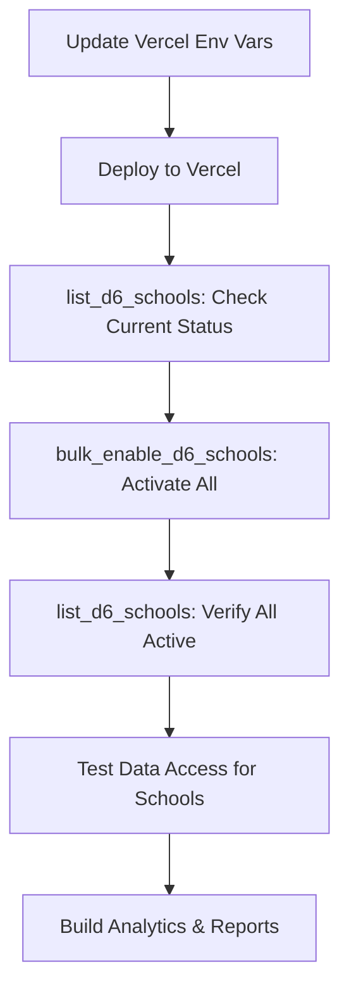

# Bulk D6 School Activation Guide

## Overview

This guide explains how to activate D6 client integrations for all 17 authorized schools at once using the `bulk_enable_d6_schools` MCP tool.

## Complete School List (17 Schools)

| # | School Login ID | School Name | Contact Person | Status |
|---|----------------|-------------|----------------|--------|
| 1 | 1450 | Laerskool Bergsig | Super User | Authorized |
| 2 | 1376 | Laerskool Louis Leipoldt | Helen Roos | Authorized |
| 3 | 2100 | Laerskool Gericke Primary | Dawie de Vries | Authorized |
| 4 | 1352 | Laerskool Monumentpark | Juanita Alberts | Authorized |
| 5 | 1674 | Hoërskool Klerksdorp | Leani Wilke | Authorized |
| 6 | 3118 | Laerskool Bredasdorp Primary School | Ethan Kyle Meyer | Authorized |
| 7 | 3664 | Laerskool Oranje-Noord | Francis Grové | Authorized |
| 8 | 2240 | Xanadu Private School | Mareli Erasmus | Authorized |
| 9 | 2219 | Rietvlei Akademie Lyttelton | Anireht Strydom | Authorized |
| 10 | 1367 | Laerskool Tzaneen Primary | Gertruida Magdalene Honeyball | Authorized |
| 11 | 1483 | Laerskool Kruinsig | Marthinus Nel | Authorized |
| 12 | 1875 | Laerskool Unika | Ruan Benadie | Authorized |
| 13 | 2752 | Kleinspoortjies Hennopspark (Pty) Ltd | Renita Wilhelmina Smith | Authorized |
| 14 | 1479 | Laerskool Boerefort | Charlene Strydom | Authorized |
| 15 | 1430 | Hoërskool Brits | Nicolaas Johannes Van der Merwe | Authorized |
| 16 | 3652 | Laerskool Eureka Kimberley | Martie Van Der Merwe | Authorized |
| 17 | 1431 | Laerskool Hennopspark | Adriana Dorethea van Noordwyk | Authorized |

## Prerequisites

### 1. Update Vercel Environment Variables

**IMPORTANT:** Before running bulk activation, update these in Vercel dashboard (Settings → Environment Variables):

**D6_ALLOWED_SCHOOL_LOGIN_IDS:**
```
1450,1376,2100,1352,1674,3118,3664,2240,2219,1367,1483,1875,2752,1479,1430,3652,1431
```

**D6_SCHOOL_MAP:**
```
1450:Laerskool Bergsig,1376:Laerskool Louis Leipoldt,2100:Laerskool Gericke Primary,1352:Laerskool Monumentpark,1674:Hoërskool Klerksdorp,3118:Laerskool Bredasdorp Primary School,3664:Laerskool Oranje-Noord,2240:Xanadu Private School,2219:Rietvlei Akademie Lyttelton,1367:Laerskool Tzaneen Primary,1483:Laerskool Kruinsig,1875:Laerskool Unika,2752:Kleinspoortjies Hennopspark (Pty) Ltd,1479:Laerskool Boerefort,1430:Hoërskool Brits,3652:Laerskool Eureka Kimberley,1431:Laerskool Hennopspark
```

After updating, Vercel will auto-redeploy (takes 1-2 minutes).

## Usage

### Step 1: Check Current Activation Status

Before bulk activation, see which schools are already active:

```json
{
  "tool": "list_d6_schools",
  "args": {}
}
```

**Returns:**
```markdown
📚 D6 Schools for Espen Integrator

Showing X of Y schools (only_active=true, only_whitelisted=true)

| school_login_id | school_name | api_type | activated_by_integrator |
|-----------------|-------------|----------|-------------------------|
| 1352 | Laerskool Monumentpark | d6 Integrate API | Yes |
| 1450 | Laerskool Bergsig | d6 Integrate API | Yes |
...
```

### Step 2: Bulk Activate All Schools

Activate all 17 schools at once:

```json
{
  "tool": "bulk_enable_d6_schools",
  "args": {
    "use_whitelist": true,
    "api_type_id": 8,
    "state": 1
  }
}
```

**Parameters:**
- `use_whitelist: true` - Uses all schools from `D6_ALLOWED_SCHOOL_LOGIN_IDS`
- `api_type_id: 8` - D6 Integrate API
- `state: 1` - Enable (use 0 to disable)

**Processing:**
- Takes approximately 8-10 seconds (17 schools × 500ms delay)
- Each school gets a `PATCH /v1/settings/clients/{id}` call
- Continues even if individual schools fail
- Logs each request: `[D6 TRACE] PATCH /v1/settings/clients/{id} -> {status}`

**Expected Response:**
```markdown
✅ Bulk D6 School Activation Complete

Summary:
- Processed: 17 schools
- Successful: 17
- Failed: 0

| School ID | School Name | Status | Response |
|-----------|-------------|--------|----------|
| 1450 | Laerskool Bergsig | ✅ Success | 204 No Content |
| 1376 | Laerskool Louis Leipoldt | ✅ Success | 204 No Content |
| 2100 | Laerskool Gericke Primary | ✅ Success | 204 No Content |
| 1352 | Laerskool Monumentpark | ✅ Success | 204 No Content |
| 1674 | Hoërskool Klerksdorp | ✅ Success | 204 No Content |
| 3118 | Laerskool Bredasdorp Primary School | ✅ Success | 204 No Content |
| 3664 | Laerskool Oranje-Noord | ✅ Success | 204 No Content |
| 2240 | Xanadu Private School | ✅ Success | 204 No Content |
| 2219 | Rietvlei Akademie Lyttelton | ✅ Success | 204 No Content |
| 1367 | Laerskool Tzaneen Primary | ✅ Success | 204 No Content |
| 1483 | Laerskool Kruinsig | ✅ Success | 204 No Content |
| 1875 | Laerskool Unika | ✅ Success | 204 No Content |
| 2752 | Kleinspoortjies Hennopspark (Pty) Ltd | ✅ Success | 204 No Content |
| 1479 | Laerskool Boerefort | ✅ Success | 204 No Content |
| 1430 | Hoërskool Brits | ✅ Success | 204 No Content |
| 3652 | Laerskool Eureka Kimberley | ✅ Success | 204 No Content |
| 1431 | Laerskool Hennopspark | ✅ Success | 204 No Content |
```

### Step 3: Verify Activation

Call `list_d6_schools` again to confirm all schools now show `activated_by_integrator: "Yes"`:

```json
{
  "tool": "list_d6_schools",
  "args": {}
}
```

### Step 4: Test Data Access

Pick a few newly activated schools and test data access:

```json
// Test learners for Laerskool Boerefort (1479)
{
  "tool": "get_learners",
  "args": {"school_login_id": 1479, "limit": 10}
}

// Test learners for Hoërskool Brits (1430)
{
  "tool": "get_learners_by_grade",
  "args": {"school_login_id": 1430, "grade": "10"}
}

// Test marks for Laerskool Eureka Kimberley (3652)
{
  "tool": "get_learner_marks",
  "args": {"school_login_id": 3652, "learnerId": "some_id"}
}
```

## Advanced Usage

### Activate Specific Schools Only

Instead of all 17, activate just a subset:

```json
{
  "tool": "bulk_enable_d6_schools",
  "args": {
    "school_login_ids": [1479, 1430, 3652, 1431],
    "api_type_id": 8,
    "state": 1,
    "use_whitelist": false
  }
}
```

### Disable Schools

To disable (deactivate) schools:

```json
{
  "tool": "bulk_enable_d6_schools",
  "args": {
    "school_login_ids": [1234],
    "api_type_id": 8,
    "state": 0,
    "use_whitelist": false
  }
}
```

## What Happens During Bulk Activation

1. **Reads whitelist** from `D6_ALLOWED_SCHOOL_LOGIN_IDS` (if `use_whitelist: true`)
2. **Validates each school** against whitelist
3. **Sends PATCH request** for each school:
   ```
   PATCH /v1/settings/clients/{school_id}
   Body: { "api_type_id": 8, "state": 1 }
   ```
4. **Waits 500ms** between requests (rate limiting)
5. **Collects results** (success/failure per school)
6. **Returns summary** with detailed table

## Expected Vercel Logs

During bulk activation, you'll see 17 log entries like:

```
[BULK ACTIVATION] Starting activation for 17 schools...
[TOOL] bulk_enable_d6_schools mock=false details={"count":17,"api_type_id":8,"state":1,"use_whitelist":true}
[D6 TRACE] PATCH /v1/settings/clients/1450 -> 204 (settings/clients/1450 [api_type_id=8, state=1]) body=<empty>
[D6 TRACE] PATCH /v1/settings/clients/1376 -> 204 (settings/clients/1376 [api_type_id=8, state=1]) body=<empty>
[D6 TRACE] PATCH /v1/settings/clients/2100 -> 204 (settings/clients/2100 [api_type_id=8, state=1]) body=<empty>
...
[BULK ACTIVATION] Complete: 17/17 successful
```

## Troubleshooting

### Issue: Some Schools Failed

**Possible causes:**
1. School not in Vercel `D6_ALLOWED_SCHOOL_LOGIN_IDS` whitelist
2. D6 hasn't authorized that school for your integrator account
3. Network timeout or rate limiting

**Solution:**
- Check error message in results table
- Verify school is in whitelist
- Contact D6 support if authorization is needed
- Retry individual schools with `enable_d6_client` tool

### Issue: All Schools Failed

**Possible causes:**
1. Vercel env vars not updated
2. Incorrect D6 credentials
3. D6 API issue

**Solution:**
1. Verify `D6_API_USERNAME` and `D6_API_PASSWORD` in Vercel
2. Check Vercel deployment succeeded
3. Test single school with `enable_d6_client` first

### Issue: "No schools in whitelist"

**Cause:** `D6_ALLOWED_SCHOOL_LOGIN_IDS` not configured in Vercel

**Solution:** Add the environment variable as shown in Prerequisites

## Tool Workflow

Complete activation and data access workflow:



## Related Tools

| Tool | Purpose | Usage |
|------|---------|-------|
| `list_d6_schools` | Discover authorized schools | Check activation status |
| `bulk_enable_d6_schools` | Activate multiple schools | One-time setup |
| `enable_d6_client` | Activate single school | Individual activation |
| `get_learners` | Access learner data | After activation |
| `get_learner_marks` | Access marks data | After Curriculum+ activation |

## API Type IDs

Common D6 API types:
- `8` - D6 Integrate API (most common for Espen)
- Others may be available - check with D6 support

## Rate Limiting

The bulk tool includes automatic rate limiting:
- **500ms delay** between each school activation
- Prevents overwhelming D6 API
- Total time for 17 schools: ~8-10 seconds

## Notes

- ✅ Safe to run multiple times (idempotent)
- ✅ Already active schools will succeed without issues
- ✅ Individual failures don't stop the entire batch
- ✅ Detailed results show exactly which schools succeeded/failed
- ✅ All operations logged to Vercel for debugging

## Next Steps After Activation

Once all 17 schools are activated:

1. **Test data access** for each school
2. **Build school dashboard** showing stats per school
3. **Enable Curriculum+** features (marks, subjects)
4. **Set up analytics** across all schools
5. **Monitor usage** via Vercel logs

## Environment Variables for Vercel

Copy-paste ready for Vercel dashboard:

**Variable: D6_ALLOWED_SCHOOL_LOGIN_IDS**
```
1450,1376,2100,1352,1674,3118,3664,2240,2219,1367,1483,1875,2752,1479,1430,3652,1431
```

**Variable: D6_SCHOOL_MAP**
```
1450:Laerskool Bergsig,1376:Laerskool Louis Leipoldt,2100:Laerskool Gericke Primary,1352:Laerskool Monumentpark,1674:Hoërskool Klerksdorp,3118:Laerskool Bredasdorp Primary School,3664:Laerskool Oranje-Noord,2240:Xanadu Private School,2219:Rietvlei Akademie Lyttelton,1367:Laerskool Tzaneen Primary,1483:Laerskool Kruinsig,1875:Laerskool Unika,2752:Kleinspoortjies Hennopspark (Pty) Ltd,1479:Laerskool Boerefort,1430:Hoërskool Brits,3652:Laerskool Eureka Kimberley,1431:Laerskool Hennopspark
```

## Support

For issues:
1. Check Vercel logs for `[D6 TRACE]` entries
2. Verify env vars are correct
3. Test individual school with `enable_d6_client`
4. Contact D6 support if authorization issues persist

