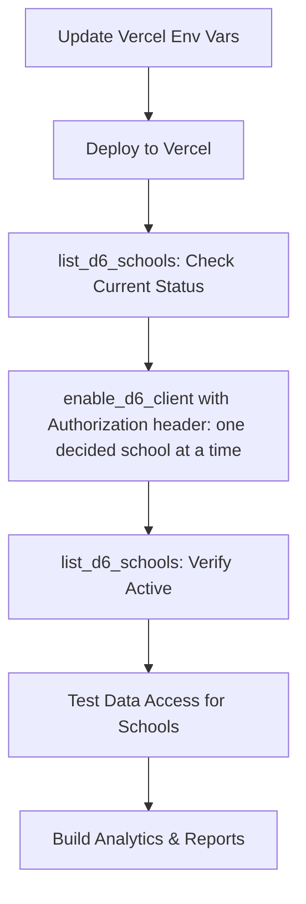

# Bulk D6 School Activation Guide

## Overview

This guide explains how to switch D6 client integrations on (or off) for several allow-listed schools in one call using the `bulk_enable_d6_schools` MCP tool.

> **Policy: Espen switches schools on one at a time.** `bulk_enable_d6_schools` is not to be run without a per-school decision for every school it would touch. Use `enable_d6_client` for each decided school instead. With `use_whitelist: true` the bulk tool switches every school in `D6_ALLOWED_SCHOOL_LOGIN_IDS` (61 schools as of 2026-09-15, not the 17 in the historical list below).

## Authentication (required)

`bulk_enable_d6_schools` and `enable_d6_client` change real schools' D6 data access, so both require an admin secret. On 2026-09-15 we confirmed they could be called by anyone with the server URL; they have required the secret since.

- Send the header `Authorization: Bearer <D6_ADMIN_SECRET>`. The secret is accepted **only** from that header, never from the URL or the JSON body.
- The secret lives in the `D6_ADMIN_SECRET` environment variable on the `espen-mcp-server-d6` Vercel project (espen-os holds the same value in its own `D6_ADMIN_SECRET`). Never paste its value into docs, chat, tickets, logs or commits.
- Without a valid secret the call gets **HTTP 401** and the JSON-RPC error `{"code": -32001, "message": "unauthorized: ..."}`, and nothing is sent to D6.
- If `D6_ADMIN_SECRET` is unset or empty on the server, both tools are refused for everyone (fail closed).
- `tools/list` only includes the two tools for a request that carries the secret.
- Read tools such as `list_d6_schools` and `get_learners` need no header.
- Every refused call leaves a `[AUTH] refused admin tool <name>` line in the Vercel logs; an accepted one logs `[AUTH] admin tool allowed <name>`.

### Calling the server

Set these once per shell. Neither value belongs in this document.

```bash
# The espen-mcp-server-d6 Vercel project, without /sse at the end.
# Do not reuse espen-os's D6_MCP_URL (the old Cloudflare worker, which has no switch-on tools)
# or D6_SYNC_MCP_URL (it already ends in /sse, so the examples would call /sse/sse).
D6_ADMIN_MCP_URL=https://espen-mcp-server-d6.vercel.app

# Paste the secret at the prompt. It is not echoed and not written to shell history.
read -rs D6_ADMIN_SECRET
```

The examples pass the header with `-H @<(printf ...)`. `printf` is a shell builtin, so the secret never appears in curl's command line, where other users, `ps`, process accounting or a `set -x` trace could see it. Don't write `-H "Authorization: Bearer $D6_ADMIN_SECRET"`: the shell expands that into curl's arguments. The output goes through `jq` to print the tool's text, or the JSON-RPC error if the call was refused. Run `unset D6_ADMIN_SECRET` when you are done.

## Original School List (17 Schools, historical)

These are the 17 schools this guide was first written for. The live allow-list is larger (61 schools as of 2026-09-15) and lives only in the `D6_ALLOWED_SCHOOL_LOGIN_IDS` environment variable on the Vercel project.

| # | School Login ID | School Name | Contact Person | Status |
|---|----------------|-------------|----------------|--------|
| 1 | 1450 | Laerskool Bergsig | Super User | Authorized |
| 2 | 1376 | Laerskool Louis Leipoldt | Helen Roos | Authorized |
| 3 | 2100 | Laerskool Gericke Primary | Dawie de Vries | Authorized |
| 4 | 1352 | Laerskool Monumentpark | Juanita Alberts | Authorized |
| 5 | 1674 | Hoërskool Klerksdorp | Leani Wilke | Authorized |
| 6 | 3118 | Laerskool Bredasdorp Primary School | Ethan Kyle Meyer | Authorized |
| 7 | 3664 | Laerskool Oranje-Noord | Francis Grové | Authorized |
| 8 | 2240 | Xanadu Private School | Mareli Erasmus | Authorized |
| 9 | 2219 | Rietvlei Akademie Lyttelton | Anireht Strydom | Authorized |
| 10 | 1367 | Laerskool Tzaneen Primary | Gertruida Magdalene Honeyball | Authorized |
| 11 | 1483 | Laerskool Kruinsig | Marthinus Nel | Authorized |
| 12 | 1875 | Laerskool Unika | Ruan Benadie | Authorized |
| 13 | 2752 | Kleinspoortjies Hennopspark (Pty) Ltd | Renita Wilhelmina Smith | Authorized |
| 14 | 1479 | Laerskool Boerefort | Charlene Strydom | Authorized |
| 15 | 1430 | Hoërskool Brits | Nicolaas Johannes Van der Merwe | Authorized |
| 16 | 3652 | Laerskool Eureka Kimberley | Martie Van Der Merwe | Authorized |
| 17 | 1431 | Laerskool Hennopspark | Adriana Dorethea van Noordwyk | Authorized |

## Prerequisites

### 1. Check the Schools Are on the Allow-List

`D6_ALLOWED_SCHOOL_LOGIN_IDS` on the `espen-mcp-server-d6` Vercel project already holds every school Espen may switch (61 schools as of 2026-09-15), and `D6_SCHOOL_MAP` holds their names. Both admin tools refuse a school that is not on the allow-list, and refuse every school if the list is empty.

- To add a decided school, **append** its ID to the end of the existing `D6_ALLOWED_SCHOOL_LOGIN_IDS` value, and `id:Name` to the end of `D6_SCHOOL_MAP`.
- **Never replace the whole value.** The read tools and espen-os's nightly marks and pastoral syncs use the same list, so every school dropped from it stops syncing.
- Vercel does **not** redeploy when an environment variable changes. The running deployment keeps the values it was built with, so after saving, redeploy the current production deployment (Deployments → ⋯ → Redeploy).

### 2. Confirm D6_ADMIN_SECRET Is Set

- `D6_ADMIN_SECRET` must be set on the `espen-mcp-server-d6` Vercel project. Without it every call below is refused with HTTP 401.
- If it was set or changed after the current deployment was built, **redeploy**. Until then the server still has the old value (or none) and keeps answering 401.
- Use a long random value, for example the output of `openssl rand -base64 48`, and give espen-os the same value. The server only checks that the value is not empty, so a short or guessable one is not caught.
- Load it into your shell as shown in "Calling the server" above.

## Usage

### Step 1: Check Current Activation Status

Before bulk activation, see which schools are already active:

```json
{
  "tool": "list_d6_schools",
  "args": {}
}
```

**Returns:**
```markdown
📚 D6 Schools for Espen Integrator

Showing X of Y schools (only_active=true, only_whitelisted=true)

| school_login_id | school_name | api_type | activated_by_integrator |
|-----------------|-------------|----------|-------------------------|
| 1352 | Laerskool Monumentpark | d6 Integrate API | Yes |
| 1450 | Laerskool Bergsig | d6 Integrate API | Yes |
...
```

### Step 2: Bulk Activate All Schools

Only with a per-school decision for every allow-listed school (see Policy above). This activates every school in `D6_ALLOWED_SCHOOL_LOGIN_IDS` at once:

```bash
curl -s "$D6_ADMIN_MCP_URL/sse" \
  -H "Content-Type: application/json" \
  -H @<(printf 'Authorization: Bearer %s\n' "$D6_ADMIN_SECRET") \
  -d '{
    "jsonrpc": "2.0",
    "id": 1,
    "method": "tools/call",
    "params": {
      "name": "bulk_enable_d6_schools",
      "arguments": { "use_whitelist": true, "api_type_id": 8, "state": 1 }
    }
  }' \
  | jq -r '.result.content[0].text // .error'
```

**Parameters:**
- `use_whitelist: true` - Uses all schools from `D6_ALLOWED_SCHOOL_LOGIN_IDS`
- `api_type_id: 8` - D6 Integrate API
- `state: 1` - Enable (use 0 to disable)

**Processing:**
- Takes about 0.5 seconds per school (500ms delay between schools)
- Checks every school against the allow-list first; if one is not on it, nothing is sent
- Each school gets a `PATCH /v1/settings/clients/{id}` call
- Continues even if individual schools fail
- Logs each request: `[D6 TRACE] PATCH /v1/settings/clients/{id} -> {status}`

**Expected Response** (the tool text printed by `jq`; without `jq`, curl prints it inside `{"jsonrpc":"2.0","id":1,"result":{"content":[{"type":"text","text":"..."}]}}`):
```markdown
✅ **Bulk D6 School Activation Enabled**

**Summary:**
- Processed: 3 schools
- Successful: 3
- Failed: 0

| School ID | School Name | Status | Response |
|-----------|-------------|--------|----------|
| 1450 | Laerskool Bergsig | ✅ Success | 204 No Content |
| 1376 | Laerskool Louis Leipoldt | ✅ Success | 204 No Content |
| 2100 | Laerskool Gericke Primary | ✅ Success | 204 No Content |
```

A refused call prints the JSON-RPC error instead, for example `{"code": -32001, "message": "unauthorized: this tool requires admin authentication"}` (HTTP 401).

### Step 3: Verify Activation

Call `list_d6_schools` again to confirm all schools now show `activated_by_integrator: "Yes"`:

```json
{
  "tool": "list_d6_schools",
  "args": {}
}
```

### Step 4: Test Data Access

Pick a few newly activated schools and test data access:

```json
// Test learners for Laerskool Boerefort (1479)
{
  "tool": "get_learners",
  "args": {"school_login_id": 1479, "limit": 10}
}

// Test learners for Hoërskool Brits (1430)
{
  "tool": "get_learners_by_grade",
  "args": {"school_login_id": 1430, "grade": "10"}
}

// Test marks for Laerskool Eureka Kimberley (3652)
{
  "tool": "get_learner_marks",
  "args": {"school_login_id": 3652, "learnerId": "some_id"}
}
```

## Advanced Usage

### Activate Specific Schools Only

Instead of every allow-listed school, activate just a subset (each one still needs its own decision). Every ID must already be in `D6_ALLOWED_SCHOOL_LOGIN_IDS`; if one is not, the whole call is refused and no school is changed:

```bash
curl -s "$D6_ADMIN_MCP_URL/sse" \
  -H "Content-Type: application/json" \
  -H @<(printf 'Authorization: Bearer %s\n' "$D6_ADMIN_SECRET") \
  -d '{"jsonrpc":"2.0","id":1,"method":"tools/call","params":{"name":"bulk_enable_d6_schools","arguments":{"school_login_ids":[1479,1430,3652,1431],"api_type_id":8,"state":1,"use_whitelist":false}}}' \
  | jq -r '.result.content[0].text // .error'
```

### Disable Schools

To disable (deactivate) schools (`1234` is a placeholder: replace it with the allow-listed school's ID; as written the call is refused because 1234 is not on the allow-list):

```bash
curl -s "$D6_ADMIN_MCP_URL/sse" \
  -H "Content-Type: application/json" \
  -H @<(printf 'Authorization: Bearer %s\n' "$D6_ADMIN_SECRET") \
  -d '{"jsonrpc":"2.0","id":1,"method":"tools/call","params":{"name":"bulk_enable_d6_schools","arguments":{"school_login_ids":[1234],"api_type_id":8,"state":0,"use_whitelist":false}}}' \
  | jq -r '.result.content[0].text // .error'
```

## What Happens During Bulk Activation

1. **Checks the admin secret** from the `Authorization` header; without a valid one the call stops here with HTTP 401
2. **Reads whitelist** from `D6_ALLOWED_SCHOOL_LOGIN_IDS` (if `use_whitelist: true` and no `school_login_ids` are given)
3. **Validates each school** against the whitelist, including every entry of `school_login_ids`. If any school is not on it, or the whitelist is empty, the call stops here and nothing is sent to D6
4. **Sends PATCH request** for each school:
   ```
   PATCH /v1/settings/clients/{school_id}
   Body: { "api_type_id": 8, "state": 1 }
   ```
5. **Waits 500ms** between requests (rate limiting)
6. **Collects results** (success/failure per school)
7. **Returns summary** with detailed table

## Expected Vercel Logs

During bulk activation, you'll see one `[D6 TRACE]` entry per school, like:

```
[AUTH] admin tool allowed bulk_enable_d6_schools
[TOOL] bulk_enable_d6_schools mock=false details={"count":3,"api_type_id":8,"state":1,"use_whitelist":true}
[BULK ACTIVATION] Starting activation for 3 schools...
[D6 TRACE] PATCH /v1/settings/clients/1450 -> 204 (settings/clients/1450 [api_type_id=8, state=1]) body=<empty>
[D6 TRACE] PATCH /v1/settings/clients/1376 -> 204 (settings/clients/1376 [api_type_id=8, state=1]) body=<empty>
[D6 TRACE] PATCH /v1/settings/clients/2100 -> 204 (settings/clients/2100 [api_type_id=8, state=1]) body=<empty>
[BULK ACTIVATION] Complete: 3/3 successful
```

## Troubleshooting

### Issue: "unauthorized" (HTTP 401, JSON-RPC code -32001)

**Cause:** No `Authorization: Bearer ...` header, a secret that does not match, or `D6_ADMIN_SECRET` not set on the Vercel project (the response is deliberately the same in all three cases)

**Solution:** Send the header with the value from the `D6_ADMIN_SECRET` environment variable on the Vercel project, confirm the variable is set there, and redeploy if it was set or changed after the current deployment was built (Vercel does not redeploy on its own). Each refusal logs `[AUTH] refused admin tool <name>` in the Vercel logs.

### Issue: "not in D6_ALLOWED_SCHOOL_LOGIN_IDS ... No school was changed."

**Cause:** At least one school in the call is not on the allow-list. The whole call is refused before any PATCH.

**Solution:** Take the school out of the call, or, once there is a decision for it, append its ID to the existing `D6_ALLOWED_SCHOOL_LOGIN_IDS` value (never replace the list) and redeploy

### Issue: Some Schools Failed

**Possible causes:**
1. D6 hasn't authorized that school for your integrator account
2. Network timeout or rate limiting

**Solution:**
- Check error message in results table
- Contact D6 support if authorization is needed
- Retry individual schools with `enable_d6_client` tool (with the `Authorization` header)

### Issue: All Schools Failed

**Possible causes:**
1. Vercel env vars not updated
2. Incorrect D6 credentials
3. D6 API issue

**Solution:**
1. Verify `D6_API_USERNAME` and `D6_API_PASSWORD` in Vercel
2. Check Vercel deployment succeeded
3. Test single school with `enable_d6_client` first

### Issue: "No schools in D6_ALLOWED_SCHOOL_LOGIN_IDS" or "D6_ALLOWED_SCHOOL_LOGIN_IDS is empty"

**Cause:** `D6_ALLOWED_SCHOOL_LOGIN_IDS` is unset or empty on the Vercel project. Both admin tools refuse every school until it is set.

**Solution:** Restore the full allow-list on the Vercel project (not a partial paste) and redeploy

## Tool Workflow

Complete activation and data access workflow:


```mermaid
graph TD
    A[Update Vercel Env Vars] --> B[Deploy to Vercel]
    B --> C[list_d6_schools: Check Current Status]
    C --> D[enable_d6_client with Authorization header: one decided school at a time]
    D --> E[list_d6_schools: Verify Active]
    E --> F[Test Data Access for Schools]
    F --> G[Build Analytics & Reports]
```

## Related Tools

| Tool | Purpose | Usage |
|------|---------|-------|
| `list_d6_schools` | Discover authorized schools | Check activation status |
| `bulk_enable_d6_schools` | Activate multiple schools | Admin secret required; only with a per-school decision for each school |
| `enable_d6_client` | Activate single school | Admin secret required; the normal way Espen switches a school on |
| `get_learners` | Access learner data | After activation |
| `get_learner_marks` | Access marks data | After Curriculum+ activation |

## API Type IDs

Common D6 API types:
- `8` - D6 Integrate API (most common for Espen)
- Others may be available - check with D6 support

## Rate Limiting

The bulk tool includes automatic rate limiting:
- **500ms delay** between each school activation
- Prevents overwhelming D6 API
- Total time: about 0.5 seconds per school

## Notes

- ✅ Safe to run multiple times (idempotent)
- ✅ Already active schools will succeed without issues
- ✅ Individual failures don't stop the entire batch
- ✅ Detailed results show exactly which schools succeeded/failed
- ✅ All operations logged to Vercel for debugging

## Next Steps After Activation

Once the decided schools are activated:

1. **Test data access** for each school
2. **Build school dashboard** showing stats per school
3. **Enable Curriculum+** features (marks, subjects)
4. **Set up analytics** across all schools
5. **Monitor usage** via Vercel logs

## Environment Variables for Vercel

The production values already exist on the `espen-mcp-server-d6` Vercel project. There is deliberately no copy-paste value here.

- **`D6_ALLOWED_SCHOOL_LOGIN_IDS`**: append a decided school's ID (`...,1234`). Never replace the whole value: every school dropped from it stops syncing in espen-os.
- **`D6_SCHOOL_MAP`**: append `1234:School Name` for the same school.
- **`D6_ADMIN_SECRET`**: see Prerequisite 2.
- After any change, redeploy. Vercel does not apply environment variable changes to a running deployment.

## Support

For issues:
1. Check Vercel logs for `[D6 TRACE]` entries
2. Verify env vars are correct
3. Test individual school with `enable_d6_client`
4. Contact D6 support if authorization issues persist

