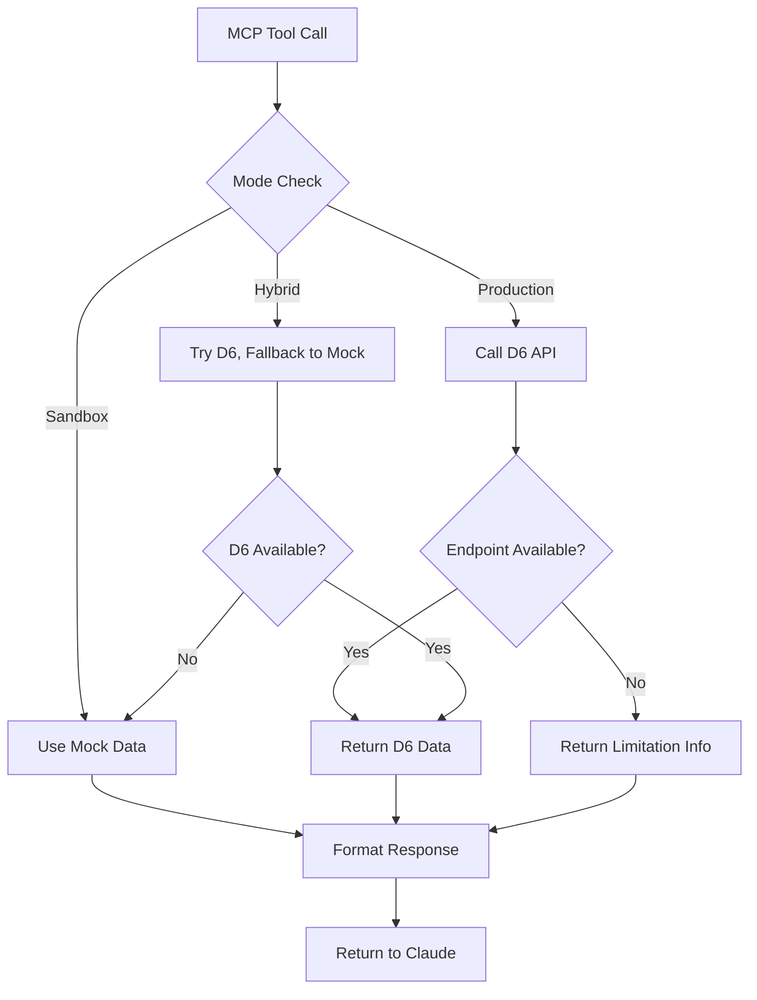

# 🏫 D6 Integration Documentation

## Overview

The Espen D6 MCP Server provides integration with D6 School Information System through the Model Context Protocol, enabling AI models to access school data for educational applications.

## 🎯 Integration Status

### ✅ Successfully Connected to D6 Test Environment

- **School**: d6 Integrate API Test School
- **Integration ID**: 1694
- **Environment**: Test (Non-billable)
- **Status**: Active and authorized

### 📊 Available D6 API Endpoints

| Endpoint | Status | Description |
|----------|--------|-------------|
| `settings/clients` | ✅ Working | School/client information |
| `adminplus/lookup/genders` | ✅ Working | Gender lookup data |
| `learners/*` | ❌ Limited | Learner data endpoints not available |
| `staff/*` | ❌ Limited | Staff data endpoints not available |
| `parents/*` | ❌ Limited | Parent data endpoints not available |
| `marks/*` | ❌ Limited | Assessment data endpoints not available |

## 🚀 Server Modes

### 1. Sandbox Mode (Default)
- **Purpose**: Development and testing
- **Data Source**: Realistic South African mock data
- **Usage**: `D6_SANDBOX_MODE=true npm run mcp`
- **Features**: 
  - 3 demo schools
  - 25+ learners with authentic names
  - 15+ staff members
  - Academic marks and assessments
  - Complete parent information

### 2. Production Mode
- **Purpose**: Real D6 API integration
- **Data Source**: Live D6 test environment
- **Usage**: `D6_PRODUCTION_MODE=true npm run mcp:production`
- **Features**:
  - Real school information from D6
  - Gender lookup data
  - Integration status and health monitoring
  - Informative messages about data limitations

### 3. Hybrid Mode
- **Purpose**: Automatic fallback between real and mock data
- **Data Source**: D6 API with sandbox fallback
- **Usage**: `npm run mcp:hybrid`
- **Features**: Best of both worlds with intelligent switching

## 🔧 Configuration

### Environment Variables

```bash
# D6 API Configuration
D6_API_BASE_URL=https://integrate.d6plus.co.za/api/v1
D6_API_USERNAME=espenaitestapi
D6_API_PASSWORD=qUz3mPcRsfSWxKR9qEnm

# Mode Selection
D6_SANDBOX_MODE=true          # Enable sandbox mode
D6_PRODUCTION_MODE=true       # Enable production mode
# (Neither set = hybrid mode)

# Optional Settings
D6_REQUEST_TIMEOUT=10000      # API timeout in milliseconds
LOG_LEVEL=info                # Logging level
```

### Claude Desktop Configuration

Add to your `mcp.json` file:

```json
{
  "mcpServers": {
    "espen-d6-sandbox": {
      "command": "npm",
      "args": ["run", "mcp"],
      "cwd": "/path/to/espen-d6-mcp-server",
      "env": {
        "D6_SANDBOX_MODE": "true"
      }
    },
    "espen-d6-production": {
      "command": "npm", 
      "args": ["run", "mcp:production"],
      "cwd": "/path/to/espen-d6-mcp-server",
      "env": {
        "D6_PRODUCTION_MODE": "true"
      }
    }
  }
}
```

## 🛠️ Available MCP Tools

| Tool | Description | Sandbox Data | Production Data |
|------|-------------|--------------|-----------------|
| `get_schools` | List available schools | 3 demo schools | 1 real D6 school |
| `get_learners` | Get learner information | 25+ mock learners | Limited (contact D6) |
| `get_learner_marks` | Academic assessments | Full mock data | Not available |
| `get_staff` | Staff information | 15+ mock staff | Not available |
| `get_parents` | Parent details | Complete mock data | Not available |
| `get_lookup_data` | System lookup values | All types | Genders only |
| `get_system_health` | API connectivity status | Always healthy | Real D6 status |
| `get_integration_info` | Integration details | Sandbox info | Real D6 setup |

## 🧪 Testing Commands

```bash
# Test D6 API endpoints
npm run test:endpoints

# Test working D6 endpoints
npm run test:working

# Test real D6 demo connection
npm run test:demo

# Test JSON output validation
npm run test:json

# Test both sandbox and production modes
npm run test:modes

# Demo sandbox data
npm run demo:sandbox
```

## 🏫 Real D6 School Information

Based on our successful connection:

```json
{
  "school_login_id": "1694",
  "school_name": "d6 Integrate API Test School",
  "admin_email_address": "support@d6plus.co.za",
  "telephone_calling_code": "27",
  "telephone_number": "012 000 0000",
  "api_type_id": "8",
  "api_type": "d6 Integrate API",
  "activated_by_integrator": "No"
}
```

## ⚠️ Current Limitations

### Data Access Limitations
The current D6 integration (ID: 1694) has limited demo data access:

1. **Learner Data**: Endpoints not available in current integration
2. **Staff Data**: Endpoints not available in current integration  
3. **Parent Data**: Endpoints not available in current integration
4. **Assessment Data**: Marks endpoints not available
5. **Lookup Data**: Only gender lookup currently available

### Recommended Actions
1. **Contact D6 Support** to activate additional endpoints for integration 1694
2. **Request Demo Data Population** for comprehensive testing
3. **Verify Endpoint Access** for learner, staff, and assessment data
4. **Expand Lookup Data** access beyond genders

## 🎭 Sandbox Data Features

Our sandbox mode provides comprehensive South African school data:

### Schools
- Greenwood Primary School (Johannesburg)
- Riverside High School (Cape Town)  
- Sunnydale Academy (Durban)

### Authentic Names
- Amara Ngcobo, Kgothatso Molefe, Thandiwe Mthembu
- Sipho Dlamini, Nomsa Khumalo, Lwazi Ndaba
- And many more realistic South African names

### Languages
- English, Afrikaans, Zulu, Xhosa, Setswana
- Authentic language distribution

### Subjects
- Mathematics, English, Afrikaans
- Natural Sciences, Social Sciences
- Life Orientation, Technology

## 🔄 Integration Workflow



## 📞 Support Contacts

- **D6 Support**: support@d6plus.co.za
- **Integration ID**: 1694
- **Environment**: Test (Non-billable)
- **API Documentation**: https://apidocs.d6plus.co.za/

## 🚀 Next Steps

1. **Expand D6 Access**: Work with D6 to enable additional endpoints
2. **Populate Demo Data**: Request comprehensive test dataset
3. **Production Deployment**: Move to production D6 environment when ready
4. **Multi-School Support**: Extend to support multiple schools
5. **Real-time Sync**: Implement data synchronization capabilities 