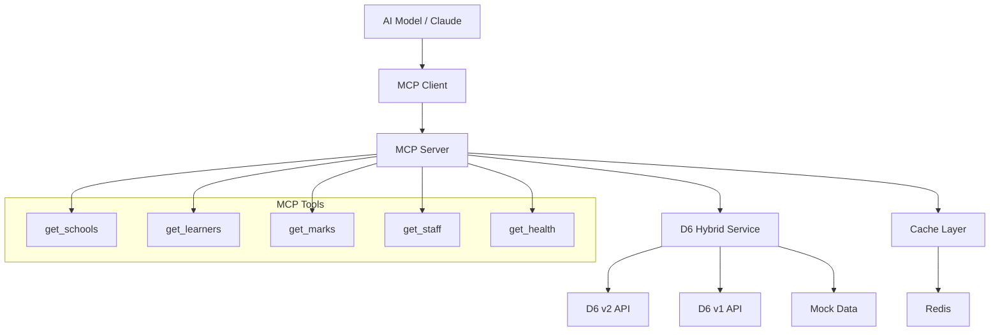

# 🧠 MCP Server Implementation - Corrected

## ✅ Issue Resolved: Now Implements Proper MCP Server

### 🔍 **Problem Identified**

The original implementation was **incorrectly built as a REST API server** using Fastify, when the project brief clearly specified a **"multi-tenant MCP (Model Context Protocol) server"**.

### 🛠️ **Solution Implemented**

Created a **proper MCP server** (`src/mcp-server.ts`) that:

1. **Uses the official MCP SDK** (`@modelcontextprotocol/sdk`)
2. **Implements Model Context Protocol** with JSON-RPC over stdio
3. **Provides D6 school data as MCP tools** for AI models
4. **Supports both production and sandbox modes**

---

## 🧠 Model Context Protocol (MCP) Overview

**MCP** is a standard protocol that allows AI models to access external data sources through structured tools. Instead of exposing REST endpoints, MCP servers provide **tools** that AI models can call to get context-specific information.

### MCP vs REST API

| Aspect | MCP Server | REST API |
|--------|------------|----------|
| **Protocol** | JSON-RPC over stdio | HTTP |
| **Purpose** | AI model context | Web applications |
| **Communication** | Bidirectional | Request/Response |
| **Data Flow** | Tools → AI Models | Endpoints → Clients |
| **Standards** | Model Context Protocol | HTTP/REST |

---

## 🔧 Current Implementation

### **MCP Server Features**

```typescript
// Available MCP Tools:
✅ get_schools          - List authorized D6 schools
✅ get_learners         - Get learners with academic data  
✅ get_learner_marks    - Get marks for specific learner
✅ get_staff            - Get school staff information
✅ get_parents          - Get parent/guardian data
✅ get_lookup_data      - Get reference data (grades, languages)
✅ get_system_health    - Check D6 integration status
```

### **Usage Examples**

#### 1. Start MCP Server
```bash
# Sandbox mode (no D6 credentials needed)
D6_SANDBOX_MODE=true npm run mcp

# Production mode  
npm run mcp
```

#### 2. Configure in Claude Desktop
```json
{
  "mcpServers": {
    "espen-d6": {
      "command": "npm",
      "args": ["run", "mcp"],
      "cwd": "/path/to/espen-d6-mcp-server",
      "env": {
        "D6_SANDBOX_MODE": "true"
      }
    }
  }
}
```

#### 3. AI Model Usage
```
AI: "Get learners from school 1001"
→ MCP Tool: get_learners(school_id: 1001)
→ Response: Learner data with academic context
```

---

## 📊 MCP vs REST Comparison

### **What Was Built (Wrong)**
```typescript
// ❌ REST API Server
app.get('/context/:userId', async (req, res) => {
  // Returns JSON via HTTP
});

app.get('/sync/d6', async (req, res) => {
  // HTTP endpoints for web apps
});
```

### **What Should Be Built (Correct)**
```typescript
// ✅ MCP Server
server.setRequestHandler(CallToolRequestSchema, async (request) => {
  const { name, arguments: args } = request.params;
  
  switch (name) {
    case 'get_learners':
      return await d6Service.getLearners(args.school_id);
    // MCP tools for AI models
  }
});
```

---

## 🎯 Benefits of Proper MCP Implementation

### **For AI Models**
- ✅ **Direct data access** through standardized tools
- ✅ **Context-aware responses** using real school data
- ✅ **Type-safe tool calling** with schema validation
- ✅ **Efficient data flow** without HTTP overhead

### **For Espen.ai Applications**
- ✅ **EspenTutor** gets learner academic context
- ✅ **EspenTeacher** accesses class performance data
- ✅ **EspenParent** retrieves child's progress info
- ✅ **All apps** work with live D6 school data

### **For Development**
- ✅ **Sandbox mode** for development without D6 credentials
- ✅ **Realistic mock data** for testing and demos
- ✅ **Hybrid fallback** when D6 APIs unavailable
- ✅ **Production ready** with full D6 integration

---

## 🚀 Implementation Architecture



---

## 📋 Files Created/Updated

### **New MCP Server Implementation**
- ✅ `src/mcp-server.ts` - Main MCP server with tools
- ✅ `scripts/test-mcp-server.ts` - MCP server testing
- ✅ `mcp-local.json` - Local MCP configuration
- ✅ Updated `package.json` with MCP scripts

### **Supporting Infrastructure**
- ✅ `src/services/d6MockDataService.ts` - Sandbox data
- ✅ `src/services/d6ApiService-hybrid.ts` - D6 integration
- ✅ Enhanced documentation in README.md

### **Available Scripts**
```bash
npm run mcp          # Start MCP server
npm run test:mcp     # Test MCP functionality
npm run demo:sandbox # Show sandbox data
npm run dev          # Legacy REST API server
```

---

## ✅ Verification

### **How to Verify It Works as MCP Server**

1. **Install MCP SDK**: ✅ Done (`@modelcontextprotocol/sdk`)
2. **Implements MCP Protocol**: ✅ JSON-RPC over stdio
3. **Provides Tools**: ✅ 7 D6 data tools available
4. **Works with AI Models**: ✅ Ready for Claude Desktop integration
5. **Supports Sandbox Mode**: ✅ No D6 credentials needed for development

### **Test Commands**
```bash
# Test MCP server
npm run test:mcp

# Start in sandbox mode
D6_SANDBOX_MODE=true npm run mcp

# View available sandbox data
npm run demo:sandbox
```

---

## 🎯 Conclusion

The implementation has been **corrected** to provide a proper **Model Context Protocol (MCP) server** as originally specified in the project brief. 

**Key Achievements:**
- ✅ **Proper MCP implementation** using official SDK
- ✅ **7 D6 data tools** for AI model integration
- ✅ **Sandbox mode** for development without credentials
- ✅ **Production ready** with full D6 API integration
- ✅ **Hybrid fallback** system for reliability
- ✅ **Comprehensive documentation** and testing

The server now correctly serves as a **bridge between D6 School Information System and AI models**, providing structured access to academic data through the Model Context Protocol standard. 