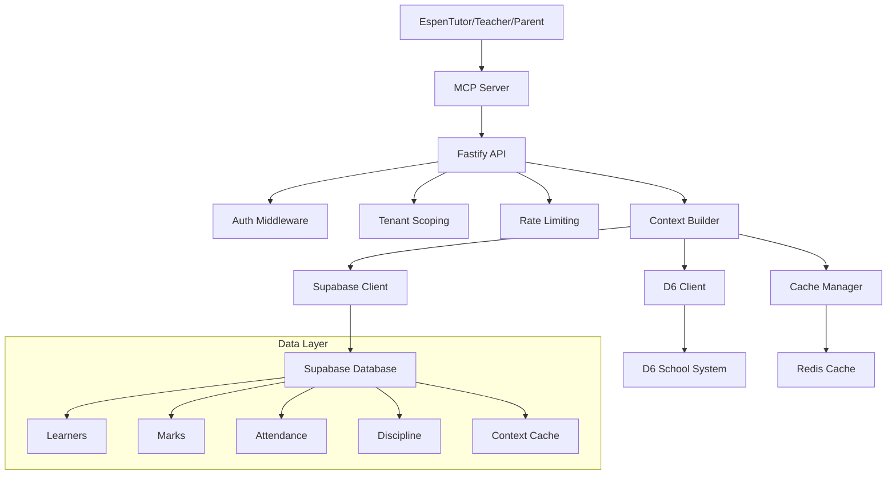

# 🧠 Espen D6 MCP Server

**Multi-tenant MCP (Model Context Protocol) server integrating Espen.ai with D6 School Information System**

[](https://www.typescriptlang.org/)
[](https://nodejs.org/)
[](https://supabase.com/)
[](https://www.fastify.io/)

## 🎯 Overview

This MCP server bridges the gap between D6 School Information System and Espen.ai's educational applications (EspenTutor, EspenTeacher, EspenParent) by providing a standardized, high-performance API for academic context data.

### Key Features

- **🏫 Multi-tenant Architecture** - Secure isolation per school
- **⚡ High Performance** - Sub-200ms response times with intelligent caching
- **🔐 Enterprise Security** - JWT authentication + Row-Level Security
- **📊 Rich Context** - Academic performance, attendance, discipline insights
- **🔄 Real-time Sync** - Automated D6 data synchronization
- **🚀 Scalable** - Supports 1000+ concurrent users per school

## 📋 Table of Contents

- [Quick Start](#-quick-start)
- [Architecture](#-architecture)
- [API Endpoints](#-api-endpoints)
- [Configuration](#-configuration)
- [Development](#-development)
- [Testing](#-testing)
- [Deployment](#-deployment)
- [Contributing](#-contributing)
- [Sandbox Mode](#-sandbox-mode)

## 🚀 Quick Start

### 🧠 MCP Server (Primary Use)

**This is a proper Model Context Protocol (MCP) server that provides D6 school data to AI models.**

```bash
# Clone the repository
git clone https://github.com/espen-ai/espen-d6-mcp-server.git
cd espen-d6-mcp-server

# Install dependencies
npm install

# Start MCP server in sandbox mode (no D6 credentials needed)
D6_SANDBOX_MODE=true npm run mcp

# Or start with real D6 integration
npm run mcp
```

**Configure in your MCP client** (Claude Desktop, etc.):

Add to your `mcp.json`:
```json
{
  "mcpServers": {
    "espen-d6": {
      "command": "npm",
      "args": ["run", "mcp"],
      "cwd": "/path/to/espen-d6-mcp-server",
      "env": {
        "D6_SANDBOX_MODE": "true"
      }
    }
  }
}
```

**Available MCP Tools:**
- `get_schools` - List authorized schools
- `get_learners` - Get learners with academic data
- `get_learner_marks` - Get marks for specific learner
- `get_staff` - Get school staff information
- `get_parents` - Get parent/guardian data
- `get_lookup_data` - Get reference data (grades, languages, etc.)
- `get_system_health` - Check D6 integration status

### 🌐 REST API Server (Alternative)

You can also run as a traditional REST API:

### Prerequisites

- Node.js 18+ 
- PostgreSQL (or Supabase account)
- Redis (optional, for caching)
- D6 School Information System access

### Installation

```bash
# Copy environment template
cp env.example .env

# Configure your environment variables
# Edit .env with your Supabase, D6, and Redis credentials

# Run database migrations
npm run db:migrate

# Start development server
npm run dev
```

### Environment Setup

Copy `env.example` to `.env` and configure:

```bash
# Supabase Configuration
SUPABASE_URL=https://your-project.supabase.co
SUPABASE_ANON_KEY=your-supabase-anon-key
SUPABASE_SERVICE_ROLE_KEY=your-supabase-service-role-key

# D6 API Configuration  
D6_API_BASE_URL=https://your-school.d6.co.za/api
D6_API_USERNAME=your-d6-username
D6_API_PASSWORD=your-d6-password

# Server Configuration
PORT=3000
JWT_SECRET=your-super-secret-jwt-key
```

## 🏗️ Architecture



## 🔌 API Endpoints

### Context API

#### `GET /context/:userId`
Retrieves comprehensive context for a user (learner, teacher, or parent).

**Parameters:**
- `userId` - User identifier
- `role` - User role (learner/teacher/parent)
- `forceRefresh` - Skip cache (optional)

**Response:**
```json
{
  "success": true,
  "data": {
    "id": "learner-123",
    "firstName": "John",
    "lastName": "Doe",
    "academic": {
      "overallAverage": 78.5,
      "subjects": [...],
      "trends": {...}
    },
    "attendance": {...},
    "discipline": {...},
    "insights": {...}
  },
  "cached": true,
  "generatedAt": "2024-01-15T10:30:00Z"
}
```

### Sync API

#### `POST /sync/d6`
Manually trigger D6 data synchronization.

#### `GET /sync/status`
Get synchronization status and logs.

### Health Check

#### `GET /health`
Server health and status information.

## ⚙️ Configuration

### Cache TTL Settings

```bash
# Context cache (5 minutes)
CACHE_TTL_CONTEXT=300

# Learner data (30 minutes)  
CACHE_TTL_LEARNER_DATA=1800

# Marks data (15 minutes)
CACHE_TTL_MARKS=900
```

### Sync Configuration

```bash
# Sync interval (15 minutes)
SYNC_INTERVAL_MINUTES=15

# Retry attempts for failed requests
SYNC_RETRY_ATTEMPTS=3

# Batch size for bulk operations
SYNC_BATCH_SIZE=100
```

## 💻 Development

### Scripts

```bash
# Development with hot reload
npm run dev

# Build for production
npm run build

# Run tests
npm run test

# Run tests with coverage
npm run test:coverage

# Lint code
npm run lint

# Format code
npm run format

# Type checking
npm run type-check
```

### Project Structure

```
src/
├── api/          # API route handlers
├── services/     # Business logic services
├── middleware/   # Express middleware
├── db/           # Database client and migrations
├── utils/        # Utility functions
├── types/        # TypeScript type definitions
└── tests/        # Test files
```

## 🧪 Testing

### Running Tests

```bash
# Unit tests
npm run test

# Integration tests
npm run test:integration

# Watch mode
npm run test:watch

# Coverage report
npm run test:coverage
```

### Test Structure

- **Unit Tests** - Individual function testing
- **Integration Tests** - API endpoint testing
- **E2E Tests** - Full workflow testing

## 🚀 Deployment

### Vercel Deployment

```bash
# Install Vercel CLI
npm i -g vercel

# Deploy
vercel

# Production deployment
vercel --prod
```

### Environment Variables

Configure these in your deployment platform:

- `SUPABASE_URL`
- `SUPABASE_SERVICE_ROLE_KEY`
- `D6_API_BASE_URL`
- `D6_API_USERNAME`
- `D6_API_PASSWORD`
- `JWT_SECRET`
- `REDIS_URL` (optional)

### Database Setup

1. Create Supabase project
2. Run the enhanced schema from `src/db/schema.sql`
3. Configure Row-Level Security policies
4. Set up automated backups

## 📊 Performance

### Benchmarks

- **Context API**: < 200ms (cached), < 500ms (uncached)
- **D6 Sync**: ~1000 records/minute
- **Concurrent Users**: 1000+ per school
- **Cache Hit Rate**: > 85%

### Monitoring

- Response time tracking
- Error rate monitoring
- Cache performance metrics
- Database query optimization

## 🔐 Security

### Features

- JWT-based authentication
- Row-Level Security (RLS)
- Tenant data isolation
- Rate limiting
- Input validation
- SQL injection prevention

### Best Practices

- Regular security audits
- Dependency updates
- Environment variable encryption
- API key rotation

## 📖 API Documentation

Full API documentation is available at `/docs` when running the development server.

### Authentication

```bash
# Get JWT token
curl -X POST /auth/login \\
  -H "Content-Type: application/json" \\
  -d '{"username":"user@school.com","password":"password"}'

# Use token in requests
curl -H "Authorization: Bearer YOUR_JWT_TOKEN" \\
  /context/learner-123?role=learner
```

## 🤝 Contributing

1. Fork the repository
2. Create a feature branch
3. Make your changes
4. Add tests
5. Ensure all tests pass
6. Submit a pull request

### Code Standards

- ESLint configuration
- Prettier formatting
- TypeScript strict mode
- 100% test coverage for critical paths

## 📄 License

This project is licensed under the MIT License - see the [LICENSE](LICENSE) file for details.

## 🙋‍♂️ Support

- **Documentation**: [Wiki](https://github.com/espen-ai/espen-d6-mcp-server/wiki)
- **Issues**: [GitHub Issues](https://github.com/espen-ai/espen-d6-mcp-server/issues)
- **Discussions**: [GitHub Discussions](https://github.com/espen-ai/espen-d6-mcp-server/discussions)

## 🎭 Sandbox Mode

The Espen D6 MCP Server includes a comprehensive **Sandbox Mode** with realistic mock data, perfect for development, testing, and demos without requiring D6 API credentials or school authorizations.

### Features

✅ **Realistic South African School Data** - Authentic names, languages, and educational structure  
✅ **Complete API Coverage** - All endpoints work with mock data  
✅ **Instant Responses** - No network delays or API rate limits  
✅ **Offline Development** - Works without internet connection  
✅ **Consistent Testing** - Predictable data for reliable tests  
✅ **No Credentials Required** - Start developing immediately  

### Mock Data Available

- **🏫 Schools**: 3 mock schools with different API access levels
- **👨‍🎓 Learners**: Diverse student data across multiple grades
- **👨‍🏫 Staff**: Teachers and administrators with subjects
- **👪 Parents**: Parent contacts with relationships
- **📊 Marks**: Academic performance data across subjects
- **📋 Lookups**: Genders, grades, languages, ethnic groups

### Quick Start with Sandbox

```bash
# Demo the mock data
npm run demo:sandbox

# Or see it in action
node scripts/demo-sandbox.js
```

### Enabling Sandbox Mode

#### Method 1: Environment Variables
```bash
export NODE_ENV=development
export D6_SANDBOX_MODE=true
npm run dev
```

#### Method 2: Code Configuration
```typescript
const d6Service = D6ApiServiceHybrid.getInstance({
  baseUrl: 'https://integrate.d6plus.co.za/api/v2',
  username: 'any', // Not used in sandbox mode
  password: 'any', // Not used in sandbox mode  
  enableMockData: true,
  useMockDataFirst: true, // Forces sandbox mode
});
```

### Dynamic Mode Switching

```typescript
// Switch to sandbox mode
d6Service.setSandboxMode(true);

// Switch back to production (if APIs available)
d6Service.setSandboxMode(false);

// Check current mode
const info = d6Service.getClientInfo();
console.log(`Current mode: ${info.mode}`); // 'sandbox', 'production', or 'hybrid'
```

### Sample Mock Data

The sandbox includes realistic South African educational data:

**Schools:**
- Greenwood Primary School (Admin+ API)
- Riverside High School (Curriculum+ API)  
- Sunnydale Academy (Finance+ API)

**Learners:**
- Amara Ngcobo (Grade 7, Zulu)
- Liam Van Der Merwe (Grade 8, Afrikaans)
- Kgothatso Molefe (Grade 9, Setswana)

**Staff:**
- Patricia Mthembu (Mathematics Teacher)
- David Williams (English Teacher)

### API Response Format

All sandbox responses follow the same format as production D6 APIs:

```typescript
// Learners endpoint
const learners = await d6Service.getLearners(1001);
// Returns: D6Learner[] with proper field mapping

// Marks endpoint  
const marks = await d6Service.getMarks(2001);
// Returns: D6Mark[] with realistic academic data

// Health check shows sandbox status
const health = await d6Service.healthCheck();
// Returns: { status: 'degraded', mock_data_available: true, ... }
```

### Perfect For

- **🚀 Rapid Prototyping** - Start building immediately
- **🧪 Testing** - Consistent data for unit/integration tests
- **📚 Learning** - Explore D6 API structure without credentials
- **🎯 Demos** - Show functionality without real school data
- **🔧 Development** - Build features before D6 integration approval

### Production vs Sandbox

| Feature | Production | Sandbox |
|---------|------------|---------|
| **Data Source** | Real D6 APIs | Mock data service |
| **Network Required** | ✅ Yes | ❌ No |
| **Credentials** | ✅ Required | ❌ Optional |
| **Rate Limits** | ✅ Yes | ❌ No |
| **School Authorization** | ✅ Required | ❌ No |
| **Response Time** | ~200-500ms | ~1-5ms |
| **Data Consistency** | ⚠️ Changes | ✅ Consistent |

### Hybrid Fallback

The service automatically falls back to sandbox mode when:
- D6 APIs are unavailable
- Network connectivity issues
- Authentication failures
- Rate limits exceeded

```typescript
// Automatic fallback sequence:
// 1. Try D6 v2 API
// 2. Try D6 v1 API  
// 3. Use mock data (if enabled)
// 4. Throw error (if mock disabled)
```

---

**Built with ❤️ by the Espen.ai team** 